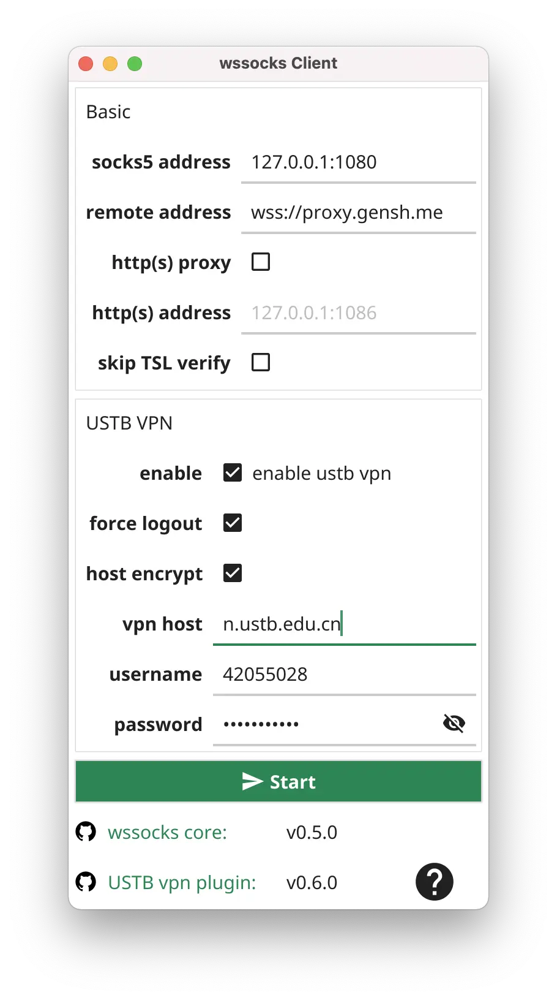

# wssocks-client 客户端使用

下载客户端后，对于 GUI 版本，可直接双击打开。 
对于 macOS 版本的，可能需要前往"安全与隐私"偏好设置中进行额外的允许，因为该 app 没有经过签名，但保证里面不含恶意代码。 

这里仅以 GUI 版本进行说明。

各项可参考下图进行填写，其中：
- wssocks 服务器地址 (**remote address**) 为: wss://proxy.gensh.me。
- **socks5 address** 是本机监听 SOCKS5 的本地地址。
- **http(s) proxy** 表示是否开启 http/https 代理，可不勾选；如果勾选则可以使用 http/https 代理。
- **http(s) address** 是开启 http/https 代理时，监听的 http/https 代理服务器的地址和端口。
- vpn **enable** 选中表示，数据包需要通过 USTB vpn 进入校内网络，如果你是在校外，一般需要勾选。如果你在校内，可以不勾选(似乎在校外，就没必要用 wssocks 了吧 😅)。
- **vpn host** 可用的有："elib.ustb.edu.cn" 和 "n.ustb.edu.cn"。如果用的是 "n.ustb.edu.cn"，需要勾选 "skip TSL verify"，
  因为似乎"n.ustb.edu.cn"网站的签名有点问题。
- **force-logout** 是指如果你的 vpn 账号在别处登录了，这里会强制先登出。一般勾选上。
- **host-encrypt** 必须勾选。
- **username** 和 **password** 为校园网用户的用户名和密码，用于登录学校 vpn。

基本按照下图所示的配置进行，即可用了 (需要换掉用户名和密码)。

配置填写完成后，点击 "**Start**" 按钮，如果没出现连接错误且按钮文字变为 "**Stop**"，即表示客户端的连接成功。
